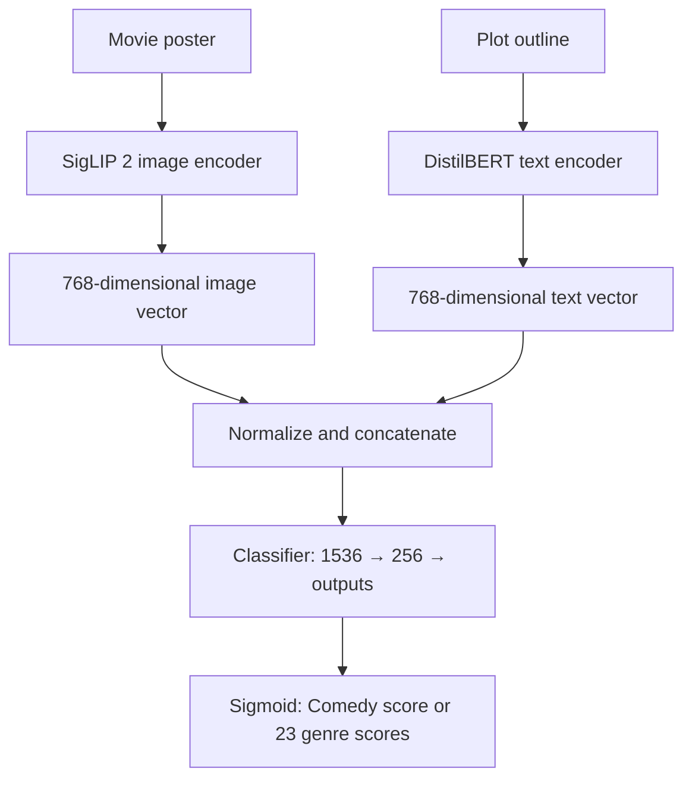

# Multimodal Movie Genre Classification

A PyTorch project that predicts movie genres from **posters and plot outlines**. It compares text-only, image-only, and combined models to test when the two inputs complement each other.

The pipeline supports Comedy detection and multilabel prediction across 23 genres. Training, evaluation, and a Comedy prediction CLI are implemented; this is an offline prototype, with no deployed application or measured business impact.

## Architecture

The main model uses pretrained **SigLIP 2** for posters and **DistilBERT** for plots. Each encoder produces a 768-dimensional vector. The vectors are normalized, concatenated, and passed through a small neural classifier.



For the main comparison, encoders stay frozen and their outputs are cached; only the classifier is trained. Each genre has an independent sigmoid score because a movie can have several genres. Training uses binary cross-entropy. Titles, genre labels, and movie IDs are not predictive inputs.

Additional experiments compare ViT, gated fusion, token-level attention, and LoRA fine-tuning. Their results are in the [full report](reports/results.md).

## Dataset and evaluation

[Tiny MM-IMDb](https://www.kaggle.com/datasets/gabrieltardochi/tiny-mm-imdb) contains 4,285 movies. The supplied splits are preserved:

| Train | Validation | Test |
| ---: | ---: | ---: |
| 2,142 | 1,071 | 1,072 |

Comedy is positive whenever it appears in a movie's genre list. The multilabel task includes the 23 genres with at least 50 training examples; News is excluded.

Learning rates, early stopping, and decision thresholds are selected on validation data. Neural results below are means over three random seeds. **AP** is average precision, a ranking metric; **macro AP** averages it equally across genres. Neither is classification accuracy.

## Results

### 23-genre prediction

| Model | Test macro AP | Test micro F1 |
| --- | ---: | ---: |
| Plot only (DistilBERT) | 0.612 | 0.604 |
| Poster only (SigLIP 2) | 0.574 | 0.584 |
| **Poster + plot, frozen encoders + classifier** | **0.709** | **0.659** |

Combining inputs beats the better of these single-input baselines on 20 of 23 genres. Posters help with visual categories such as Animation; plots help with categories such as Biography and History.

### Comedy detection

| Model | Test AP | Test F1 |
| --- | ---: | ---: |
| TF-IDF + logistic regression | 0.489 | 0.534 |
| Poster only (SigLIP 2) | 0.764 | 0.674 |
| Poster + plot, frozen encoders + classifier | 0.766 | 0.706 |
| Poster + plot, LoRA + classifier | 0.775 | 0.708 |

The LoRA model was selected on validation AP. Its gain over the corresponding frozen model is small; the clearest benefit from combining inputs is on the 23-genre task. The binary and multilabel headline results come from separate models.

See [all experiments and latency measurements](reports/results.md) and [error analysis](reports/error_analysis.md).

## Run locally

Use Python 3.12 and [uv](https://docs.astral.sh/uv/). The first run downloads the dataset and pretrained weights through KaggleHub and Hugging Face.

```bash
uv venv --python 3.12 .venv
uv pip install --python .venv/bin/python -r requirements-lock.txt
mkdir -p artifacts

# Check data and cache the encoder outputs used by the comparisons.
.venv/bin/python -m src.data
.venv/bin/python -m src.embed --backbone vit_distilbert
.venv/bin/python -m src.embed --backbone siglip2

# Core comparisons: plot only, poster only, and combined inputs (3 seeds).
.venv/bin/python -m src.train --task multilabel --experiments vd_text sg_image sd_concat
.venv/bin/python -m src.baselines
.venv/bin/python -m src.train --task binary --experiments vd_text sg_image sd_concat

# Predict Comedy with the frozen combined model trained above.
.venv/bin/python -m src.predict --movie-id 0077598 --run binary/sd_concat/seed0
.venv/bin/python -m pytest -q
```

Optional: reproduce the fine-tuned Comedy model after training the frozen binary model:

```bash
.venv/bin/python -m src.finetune --backbone siglip2_distilbert --head concat
```

Recorded compute on an Apple M4 (16 GB): about **5 minutes** to cache both encoder families, **15 minutes** for the full set of frozen-head experiments, and **20 minutes per seed** for LoRA. Initial downloads are additional; hardware and the chosen experiments affect runtime. Cached features and model artifacts stay local and are excluded from Git.

## Limitations

- Results use one small dataset and its supplied split; performance on new catalogs or missing inputs has not been established.
- Some identical plots/posters cross splits. The current scores use the original split, not a fully deduplicated benchmark. Pretrained encoders may also have seen these movies previously.
- Genre annotations can be subjective or incomplete. Predictions are suggestions, not proof of incorrect catalog tags.
- Three seeds measure training variation, not uncertainty across datasets. Small score differences should be interpreted cautiously.
- The CLI predicts Comedy only. Multilabel evaluation is implemented, but a general genre-prediction interface and catalog-review workflow remain future work.

## Repository

- [`src/`](src/): data loading, encoders, classifiers, training, evaluation, and inference.
- [`reports/`](reports/): full results, figures, error analysis, and local latency measurements.
- [`notebooks/01_multimodal_demo.ipynb`](notebooks/01_multimodal_demo.ipynb): initial prototype walkthrough.
- [`tests/`](tests/): labels, pooling, attention masks, adapters, and metric checks.

Dataset and research credit: [Tiny MM-IMDb](https://www.kaggle.com/datasets/gabrieltardochi/tiny-mm-imdb), based on [MM-IMDb / Gated Multimodal Units for Information Fusion](https://arxiv.org/abs/1702.01992). Download posters and plots from the dataset source; they are not distributed in this repository.
