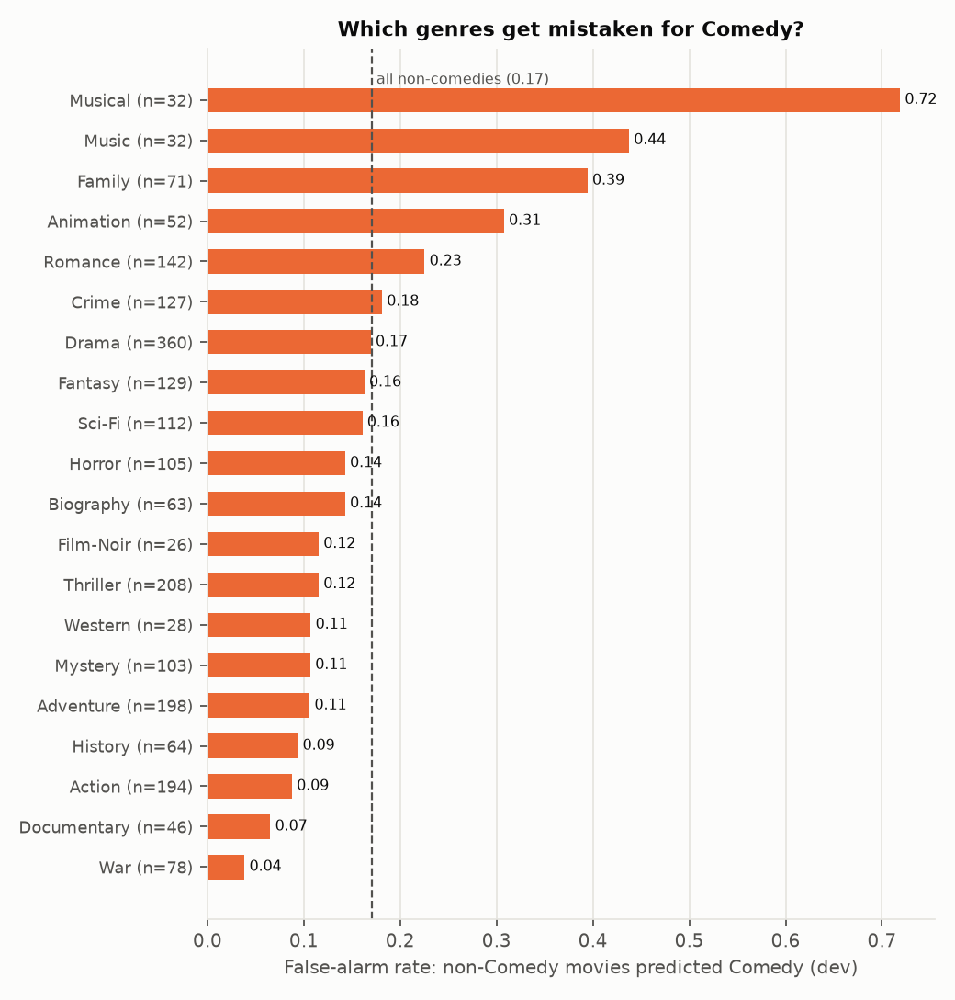

# Error analysis (dev split)

Model: `binary/sd_lora_concat/seed0` · threshold 0.381 (max-F1 on dev) · dev P 0.713 / R 0.775 / F1 0.743.
Dev is used so the test split stays untouched. Titles and genre tags only; no posters or plots.

## Error rates by co-occurring genre (n ≥ 25 per cell)

| Genre | Comedies with genre | Miss rate | Non-comedies with genre | False-alarm rate |
| --- | ---: | ---: | ---: | ---: |
| Musical | 37 | 0.14 | 32 | 0.72 |
| Music | 18 | — | 32 | 0.44 |
| Family | 90 | 0.14 | 71 | 0.39 |
| Animation | 50 | 0.18 | 52 | 0.31 |
| Romance | 93 | 0.23 | 142 | 0.23 |
| Crime | 65 | 0.20 | 127 | 0.18 |
| Drama | 111 | 0.30 | 360 | 0.17 |
| Fantasy | 67 | 0.21 | 129 | 0.16 |
| Sci-Fi | 26 | 0.31 | 112 | 0.16 |
| Biography | 12 | — | 63 | 0.14 |
| Horror | 39 | 0.46 | 105 | 0.14 |
| Thriller | 66 | 0.44 | 208 | 0.12 |
| Film-Noir | 0 | — | 26 | 0.12 |
| Western | 8 | — | 28 | 0.11 |
| Mystery | 45 | 0.27 | 103 | 0.11 |
| Adventure | 83 | 0.20 | 198 | 0.11 |
| History | 8 | — | 64 | 0.09 |
| Action | 79 | 0.34 | 194 | 0.09 |
| Documentary | 11 | — | 46 | 0.07 |
| War | 12 | — | 78 | 0.04 |
| News | 0 | — | 5 | — |
| Short | 23 | — | 16 | — |
| Sport | 19 | — | 21 | — |

## Most confident false positives

| Title | Reference genres | Score |
| --- | --- | ---: |
| Knick Knack | Short, Family, Animation | 0.973 |
| The Perks of Being a Wallflower | Drama, Romance | 0.960 |
| My Fair Lady | Romance, Drama, Family, Musical | 0.909 |
| Pooh's Grand Adventure: The Search for Christopher Robin | Musical, Family, Adventure, Animation | 0.904 |
| Geri's Game | Short, Family, Animation | 0.884 |
| Julie & Julia | Biography, Drama, Romance | 0.874 |
| Dirty Dancing | Music, Drama, Romance | 0.859 |
| A Chorus Line | Music, Drama, Musical | 0.856 |
| Blue Crush | Sport, Drama, Romance | 0.855 |
| Party Monster | Biography, Crime, Drama, Thriller | 0.854 |

## Most confident misses

| Title | Reference genres | Score |
| --- | --- | ---: |
| Casanova | Romance, Drama, Comedy, Adventure | 0.013 |
| Iron Sky | Comedy, Action, Sci-Fi | 0.015 |
| Rang De Basanti | Drama, History, Comedy, Romance | 0.017 |
| Dungeons & Dragons | Adventure, Fantasy, Comedy, Action | 0.019 |
| Daai mo seut si | Mystery, Drama, Comedy, Romance | 0.020 |
| Paperman | Short, Family, Comedy, Romance, Animation | 0.025 |
| Kabul Express | Thriller, Drama, Comedy, Action | 0.034 |
| Tales from the Darkside: The Movie | Fantasy, Comedy, Horror, Thriller | 0.044 |
| The Feathered Serpent | Crime, Thriller, Comedy, Mystery, Horror | 0.051 |
| Chimes at Midnight | War, Drama, History, Comedy | 0.052 |

## Modality reliance

- `binary/sd_gmu/seed0` GMU text-gate mean (1 = all plot, 0 = all poster): all 0.329, comedy 0.330, not_comedy 0.329
- `binary/sd_xattn/seed0` [FUSE] last-layer attention share: text 0.266, image 0.721

