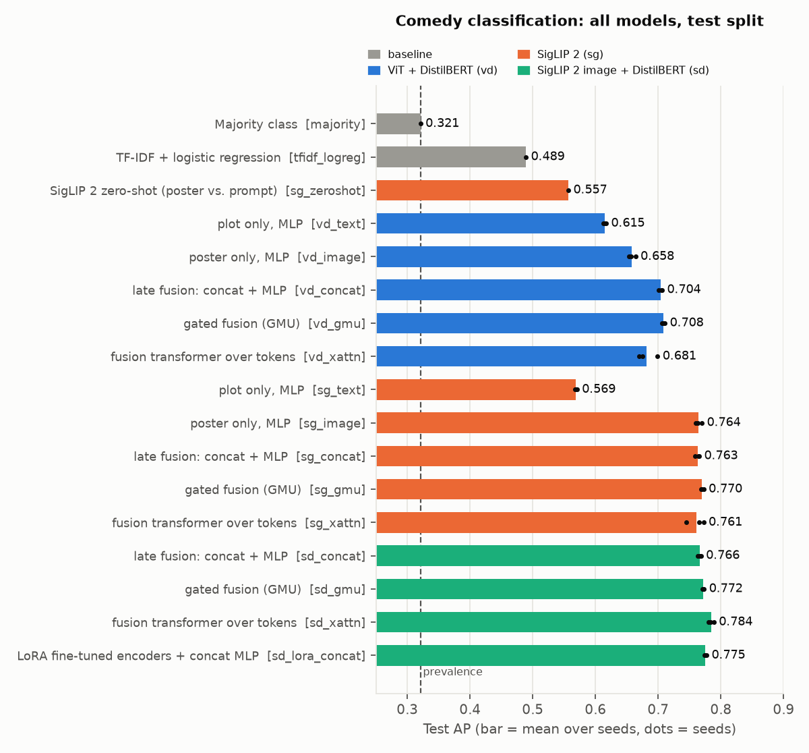
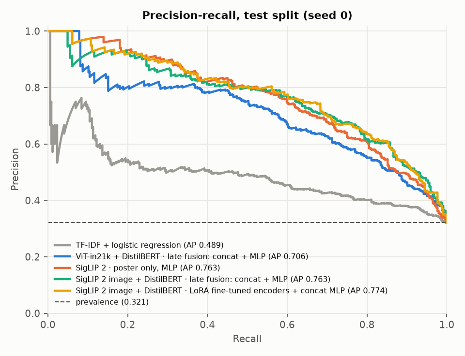
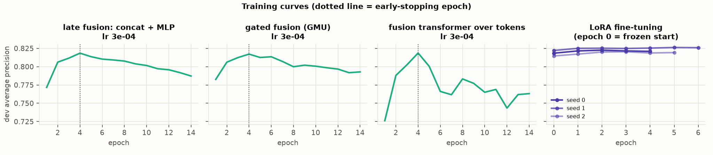
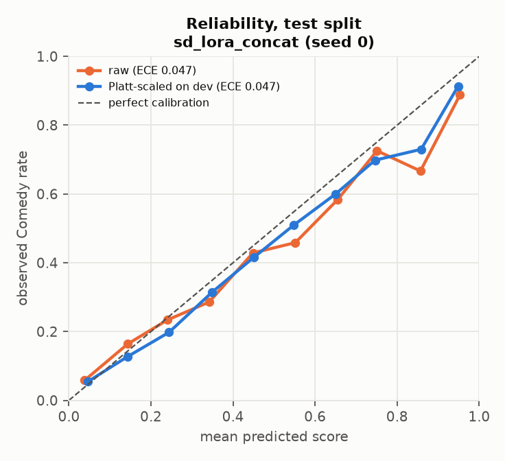
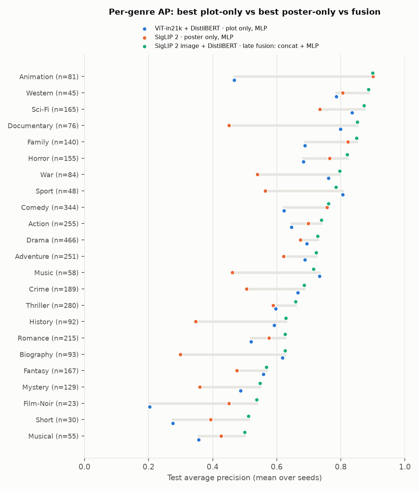

# Results

Generated by `python -m src.report` from `artifacts/runs/`.

## Version 1: Comedy vs. not Comedy

Supplied splits: train 2,142 · dev 1,071 · test 1,072 (344 Comedy, prevalence 0.321). Learning rate (and C for TF-IDF) chosen on dev; decision threshold = max-F1 on dev. Mean ± std over seeds. **Bold = selected on dev AP.** ECE uses 15 bins on raw scores.

| Backbone | Model | Inputs | Trainable params | Seeds | Dev AP | Test AP | Test ROC AUC | Test F1 | Brier | ECE |
| --- | --- | --- | ---: | ---: | ---: | ---: | ---: | ---: | ---: | ---: |
| — | Majority class | none | 0 | 1 | 0.353 | 0.321 | 0.500 | 0.000 | 0.218 | 0.022 |
| — | TF-IDF + logistic regression | plot | 8,572 | 1 | 0.542 | 0.489 | 0.681 | 0.534 | 0.220 | 0.139 |
| — | SigLIP 2 zero-shot (poster vs. prompt) | poster | 0 | 1 | 0.597 | 0.557 | 0.693 | 0.531 | 0.309 | 0.311 |
| ViT-in21k + DistilBERT | plot only, MLP | plot | 198,657 | 3 | 0.703 ± 0.002 | 0.615 ± 0.002 | 0.781 ± 0.001 | 0.595 ± 0.013 | 0.191 ± 0.018 | 0.112 ± 0.067 |
| ViT-in21k + DistilBERT | poster only, MLP | poster | 198,657 | 3 | 0.694 ± 0.002 | 0.658 ± 0.004 | 0.783 ± 0.003 | 0.600 ± 0.005 | 0.187 ± 0.002 | 0.128 ± 0.005 |
| ViT-in21k + DistilBERT | late fusion: concat + MLP | plot + poster | 396,801 | 3 | 0.757 ± 0.003 | 0.704 ± 0.002 | 0.828 ± 0.001 | 0.656 ± 0.005 | 0.166 ± 0.003 | 0.101 ± 0.011 |
| ViT-in21k + DistilBERT | gated fusion (GMU) | plot + poster | 790,529 | 3 | 0.755 ± 0.001 | 0.708 ± 0.002 | 0.829 ± 0.001 | 0.656 ± 0.004 | 0.159 ± 0.004 | 0.077 ± 0.021 |
| ViT-in21k + DistilBERT | fusion transformer over tokens | plot + poster | 1,452,545 | 3 | 0.741 ± 0.007 | 0.681 ± 0.013 | 0.816 ± 0.005 | 0.636 ± 0.001 | 0.178 ± 0.011 | 0.107 ± 0.028 |
| SigLIP 2 | plot only, MLP | plot | 198,657 | 3 | 0.651 ± 0.001 | 0.569 ± 0.001 | 0.727 ± 0.001 | 0.557 ± 0.005 | 0.222 ± 0.009 | 0.174 ± 0.025 |
| SigLIP 2 | poster only, MLP | poster | 198,657 | 3 | 0.787 ± 0.001 | 0.764 ± 0.004 | 0.853 ± 0.002 | 0.674 ± 0.008 | 0.153 ± 0.004 | 0.111 ± 0.014 |
| SigLIP 2 | late fusion: concat + MLP | plot + poster | 396,801 | 3 | 0.806 ± 0.001 | 0.763 ± 0.003 | 0.862 ± 0.002 | 0.700 ± 0.010 | 0.153 ± 0.007 | 0.107 ± 0.026 |
| SigLIP 2 | gated fusion (GMU) | plot + poster | 790,529 | 3 | 0.809 ± 0.001 | 0.770 ± 0.002 | 0.866 ± 0.000 | 0.703 ± 0.002 | 0.155 ± 0.004 | 0.129 ± 0.011 |
| SigLIP 2 | fusion transformer over tokens | plot + poster | 1,452,545 | 3 | 0.796 ± 0.003 | 0.761 ± 0.012 | 0.863 ± 0.006 | 0.696 ± 0.013 | 0.187 ± 0.012 | 0.194 ± 0.018 |
| SigLIP 2 image + DistilBERT | late fusion: concat + MLP | plot + poster | 396,801 | 3 | 0.818 ± 0.003 | 0.766 ± 0.002 | 0.868 ± 0.000 | 0.706 ± 0.003 | 0.142 ± 0.002 | 0.082 ± 0.010 |
| SigLIP 2 image + DistilBERT | gated fusion (GMU) | plot + poster | 790,529 | 3 | 0.816 ± 0.001 | 0.772 ± 0.001 | 0.871 ± 0.001 | 0.701 ± 0.001 | 0.154 ± 0.002 | 0.132 ± 0.010 |
| SigLIP 2 image + DistilBERT | fusion transformer over tokens | plot + poster | 1,452,545 | 3 | 0.811 ± 0.006 | 0.784 ± 0.003 | 0.878 ± 0.003 | 0.724 ± 0.005 | 0.156 ± 0.011 | 0.140 ± 0.033 |
| **SigLIP 2 image + DistilBERT** | **LoRA fine-tuned encoders + concat MLP** | **plot + poster** | **839,169** | **3** | **0.823 ± 0.002** | **0.775 ± 0.001** | **0.868 ± 0.001** | **0.708 ± 0.006** | **0.141 ± 0.004** | **0.069 ± 0.015** |

Selected on dev: **sd_lora_concat** (SigLIP 2 image + DistilBERT · LoRA fine-tuned encoders + concat MLP).

Calibration of the selected model (seed 0, test): ECE 0.047 raw → 0.047 after Platt scaling fit on dev; Brier 0.135 → 0.133. Training up-weights positives (pos_weight), which can push raw scores high; check the reliability plot before reading scores as probabilities.

## Inference latency

End to end (poster decode + preprocessing + both encoders + head), batch 1, warm, 50 test movies, Apple M4 (arm64). `python -m src.benchmark`. Not a serving benchmark (no API, no concurrency).

| Run | Params | CPU p50 / p95 (ms) | MPS p50 / p95 (ms) | max abs(live − cached score) |
| --- | ---: | ---: | ---: | ---: |
| `binary/vd_concat/seed0` | 153M | 65 / 78 | 34 / 97 | 5e-05 |
| `binary/sd_concat/seed0` | 160M | 67 / 81 | 33 / 45 | 5e-05 |
| `binary/sd_xattn/seed0` | 161M | 68 / 82 | 35 / 50 | 6e-05 |
| `binary/sd_lora_concat/seed0` | 160M | 72 / 85 | 34 / 54 | 1e-03 |

Live scores are rounded to 4 decimals (5e-5 floor). The LoRA run's stored scores came from an fp16 pixel cache used for training speed, hence its ~1e-3 gap.

## Version 2: multilabel genres

23 genres with ≥ 50 training movies (News dropped). One sigmoid output per genre, BCE loss; per-genre thresholds = max-F1 on dev. Learning rate selected on dev macro AP. Mean ± std over seeds.

| Backbone | Model | Inputs | Seeds | Dev macro AP | Test macro AP | Test micro AP | Test micro F1 | Test macro F1 | Tags predicted / true |
| --- | --- | --- | ---: | ---: | ---: | ---: | ---: | ---: | ---: |
| ViT-in21k + DistilBERT | plot only, MLP | plot | 3 | 0.619 ± 0.001 | 0.612 ± 0.002 | 0.651 ± 0.001 | 0.604 ± 0.003 | 0.581 ± 0.003 | 4.03 / 3.21 |
| ViT-in21k + DistilBERT | poster only, MLP | poster | 3 | 0.402 ± 0.001 | 0.376 ± 0.001 | 0.473 ± 0.001 | 0.467 ± 0.004 | 0.405 ± 0.002 | 4.88 / 3.21 |
| SigLIP 2 | plot only, MLP | plot | 3 | 0.543 ± 0.001 | 0.534 ± 0.002 | 0.578 ± 0.000 | 0.563 ± 0.001 | 0.529 ± 0.004 | 4.55 / 3.21 |
| SigLIP 2 | poster only, MLP | poster | 3 | 0.593 ± 0.002 | 0.574 ± 0.001 | 0.635 ± 0.002 | 0.584 ± 0.003 | 0.559 ± 0.003 | 4.01 / 3.21 |
| SigLIP 2 image + DistilBERT | late fusion: concat + MLP | plot + poster | 3 | 0.718 ± 0.001 | 0.709 ± 0.003 | 0.724 ± 0.002 | 0.659 ± 0.003 | 0.654 ± 0.000 | 4.05 / 3.21 |
| SigLIP 2 image + DistilBERT | gated fusion (GMU) | plot + poster | 3 | 0.709 ± 0.002 | 0.703 ± 0.001 | 0.718 ± 0.001 | 0.655 ± 0.003 | 0.651 ± 0.003 | 3.92 / 3.21 |
| SigLIP 2 image + DistilBERT | fusion transformer over tokens | plot + poster | 3 | 0.705 ± 0.005 | 0.698 ± 0.004 | 0.713 ± 0.005 | 0.653 ± 0.003 | 0.644 ± 0.006 | 3.90 / 3.21 |

Poster beats plot most on: Animation (+0.43), Film-Noir (+0.25), Comedy (+0.14), Family (+0.13). Plot beats poster most on: Documentary (-0.35), Biography (-0.32), Music (-0.27), History (-0.25).

Fusion beats the better single modality on 20 of 23 genres.

